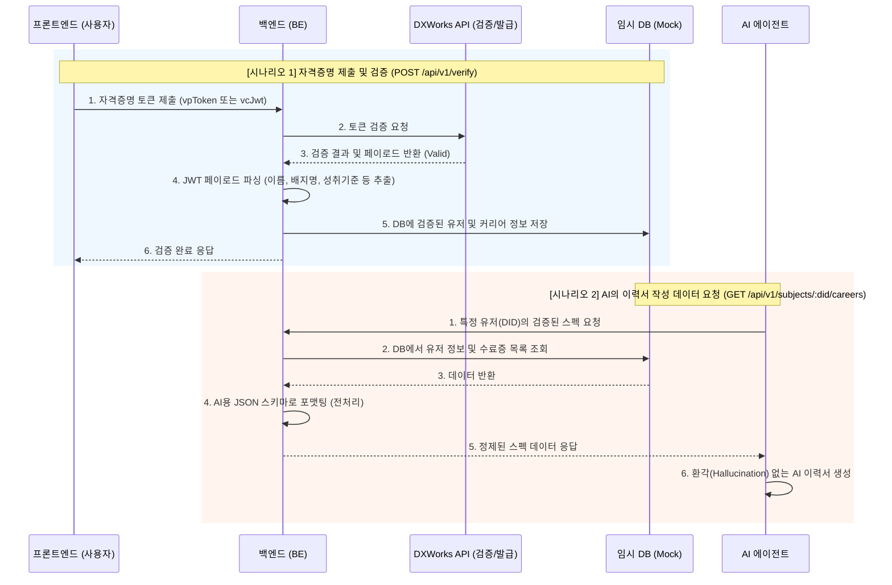

# BE 파트 — VC 검증 및 AI 데이터 서빙 프록시 서버

이 프로젝트는 프론트엔드에서 제출한 자격증명(VC)을 DXWorks API를 통해 검증하고, 그 결과를 DB에 저장한 뒤, AI 에이전트가 이해할 수 있는 정제된 형태(JSON)로 제공하는 **BFF(Backend For Frontend) 서버**입니다.

## 1. 아키텍처 흐름도 (Flowchart)



## 2. 요구 사항 및 초기 설정

- Node.js 18 이상 권장
- npm

처음 레포지토리를 클론받은 직후 아래 명령어들을 실행하세요.

```bash
cd BE
npm install
cp .env.example .env
```
> **주의:** `.env` 파일 안의 `DXWORKS_API_KEY` 항목에 발급받은 실제 API 키를 꼭 입력해야 검증 및 발급이 정상 동작합니다.

## 3. 실행 방법 (BE 메인 서버)

백엔드 서버를 띄우는 방법입니다. 코드를 수정할 때마다 자동으로 재시작되는 개발 모드를 권장합니다.

```bash
# 개발 모드 (코드 수정 시 자동 재시작)
npm run dev

# 빌드 및 운영 모드
npm run build
npm start
```
- 기본 포트: `3000` (Base URL: `http://localhost:3000`)

## 4. API 시나리오 및 Postman 작동 플로우

포스트맨(Postman) 등에서 아래 순서대로 호출하며 메인 시나리오를 테스트할 수 있습니다.

### [시나리오 A] 사용자가 획득한 배지를 제출하여 인증받기
- **Method:** `POST`
- **URL:** `http://localhost:3000/api/v1/verify`
- **Body (JSON):**
  ```json
  {
    "type": "badge",
    "token": "eyJhbGciOiJFZERTQSIsInR5cCI6IkpXVCJ9..."
  }
  ```
  *(Identity 토큰인 경우 `"type": "identity"`로 지정)*
- **결과:** 검증이 성공하면 터미널 로그에 `[DB Mock] Saving career...`가 찍히며 메모리 DB에 저장됩니다.

### [시나리오 B] AI가 이력서 작성을 위해 유저 스펙 조회하기
- **Method:** `GET`
- **URL:** `http://localhost:3000/api/v1/subjects/{유저의_did}/careers`
  - *(예: `http://localhost:3000/api/v1/subjects/did:key:z6Mk.../careers`)*
- **결과:** 방금 A단계에서 저장된 배지 정보가 AI가 읽기 좋은 규격화된 JSON 배열 형태로 출력됩니다.

---

## 5. 논문 테스트용 임시 발급 서버 (Mock Issuer) 사용법

논문 작성을 위해 대량의 테스트용 가상 학생 데이터가 필요한 경우, 직접 블록체인 발급 환경을 구축할 필요 없이 내장된 '임시 발급 API'를 이용할 수 있습니다. 

### 실행 및 호출 방법
별도의 서버를 띄울 필요 없이, **메인 BE 서버(`npm run dev`)가 켜져 있는 상태**에서 아래 엔드포인트를 호출하기만 하면 됩니다.

- **Method:** `POST`
- **URL:** `http://localhost:3000/api/mock-issuer/issue`
- **Body (JSON):**
  ```json
  {
    "templateId": "f9499c5f-6611-45c6-b5a8-683a99040aab", 
    "holderDid": "did:key:학생의고유ID"
  }
  ```
- **작동 원리:** 백엔드가 내부적으로 DXWorks 기관 발급 서버를 대신 찔러서, 실제 서명이 완료된 테스트용 자격증명(VC-JWT)을 응답으로 리턴해 줍니다. Python 스크립트 등에서 이 API를 for문으로 돌리면 테스트 데이터를 무한히 생성할 수 있습니다.
